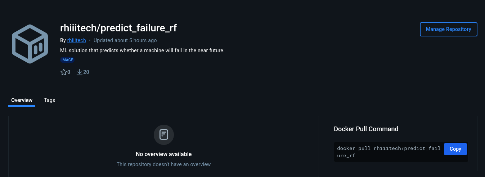
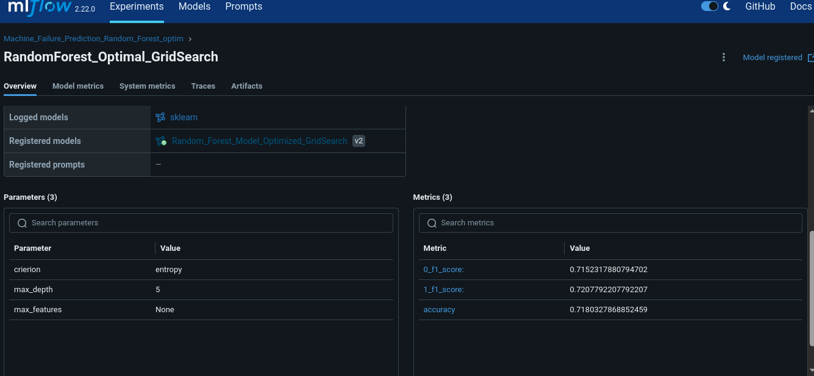

# Walmart-MLE-Evaluation
## Data Science Project Scenario

1. **Sources**

Dataset

Use the public Microsoft Azure Predictive Maintenance dataset on Kaggle:

https://www.kaggle.com/datasets/arnabbiswas1/microsoft-azure-predictive-maintenance/data

Goal

Build an end-to-end ML solution that predicts whether a machine will fail in the near future, using the provided dataset. Focus on clean engineering and deployment craftsmanship; the modelling can be simple if it is defensible.

2. **Core Expectations**

- **Reproducibility** – can we run it straight away?
- **Software Engineering** – code quality, design, structure, modern Python practices.
- **MLOps/Maturity** – ML life cycle, deployment, automation & maintainability.
- **Documentation** – is your reasoning, process and system well-explained and easy to follow?
- **Model performance** – sensible approach and metrics (state-of-the-art not required).

## Project structure
The repository has the following structure:
Walmart-MLE-Evaluation
    - Data\
        - test\
        - training\
        (DatasetFiles.csv)\
    - graphs\
    - venv\
    - airflow_env\
    - mlruns\
    - Predictive-Maintenance.ipynb\
    - model_inference_dag.py\
    - requirements.txt\

The *Data* folder includes the datasets downloaded from the public Microsoft Azure Predictive Maintenance dataset on Kaggle. It also includes the versioning for the data set obtained after the data processing, and the versions for the split data used for training and test. The data version control were carried out with **DVC**.

The *graphs* folder includes the bar chart of the feature importance for the selected Random Forest model.

The *venv* and *airflow_env* are the virtual environment folder, for the modelling step and the Airflow deployment.

The *Predictive-Maintenance.ipynb* Jupyter Notebook includes the whole of the data processing and the training and selection of the propused models.

The *model_inference_dag.py* file includes the **DAG** proposal for an airflow deployment.

The selected model was packaged into a Docker Image using:
> mlflow models build-docker -m runs:/295afc8d9ade47ea9fc862287581b7a8/Random_Forest_Model_Optimized_GridSearch -n RF_Optim_Failure_Prediction --enable-mlserver
It was pushed and with public access at my DockerHub repo:
> rhiitech/predict_failure_rf:latest

The requierements.txt are managed with MLflow but the *requirements.txt* file also contains the requirements for the model selection.

The model_inference_dag DAG file proposed a daily POST request for simulated data taken from the test dataset. It could be replaced for batched real dataset taken from a database or a bucket data lake.

Improvements Proposed:
Several aspects of the project could be improved or implemented.
1. Direct deployment into a cloud service: (i.e. AWS Sage Maker).
2. Optimization of the batched process script with Airflow.
3. Explore another models (i.e. Neural Networks).
4. Include an orchestator for deployment and scaling (i.e. Kubernetes).
5. Add a monitoring layer. The Docker Image included the API endpoint for an implementation with Prometheus + Grafana. 